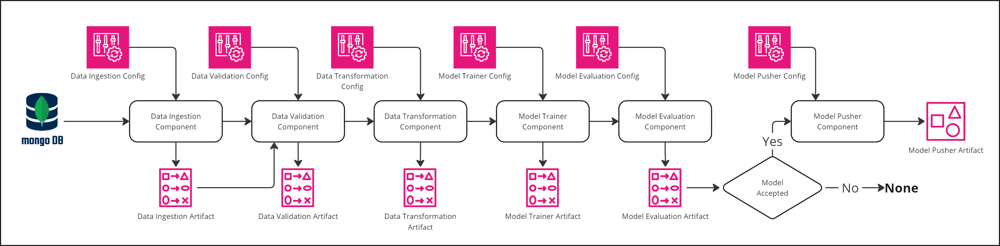
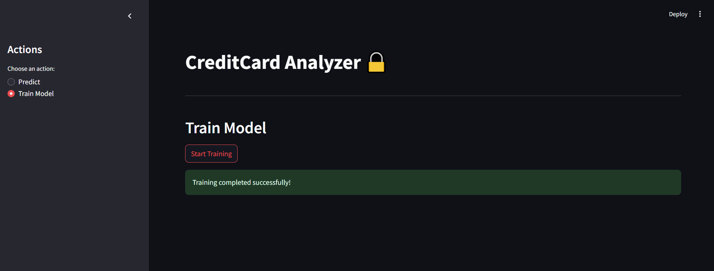
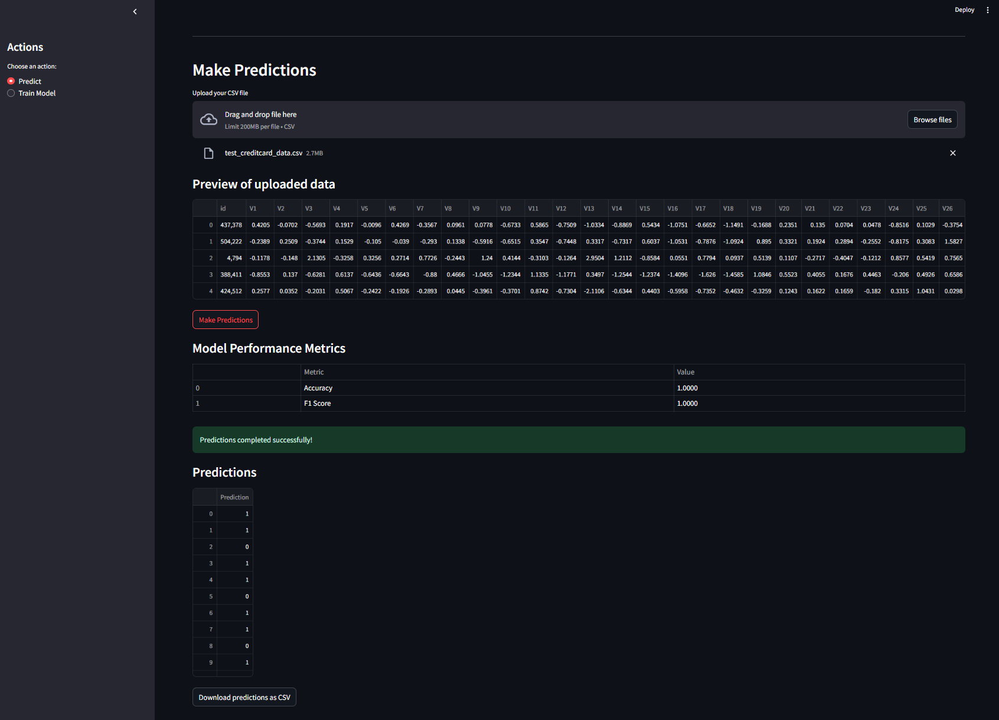

# Credit Card Fraud Detection ML Pipeline

A comprehensive machine learning pipeline for credit card fraud detection, featuring automated data processing, model training, and flexible deployment options including local and Azure ML endpoints.

## 🎯 Objective

This project aims to detect fraudulent credit card transactions using machine learning techniques. The model analyzes various transaction characteristics to identify potentially fraudulent activities. Key features include:

- Transaction Amount
- Time of Transaction
- Anonymized Features (V1-V28): Principal components obtained from original transaction data
- Class: Binary target indicating fraudulent (1) or legitimate (0) transactions

The model provides binary classification to determine if a transaction is legitimate (0) or fraudulent (1), helping financial institutions protect their customers from unauthorized charges.

## 🌟 Features

- **Data Ingestion**: Data Ingestion from MongoDB
- **Data Validation**: Automated feature validation
- **Model Training**: Optimized hyperparameter tuning with multiple model options
- **Azure Deployment**: Azure ML Batch deployment 
- **Interactive UI**: Streamlit-based interface
- **CI/CD**: Continuous integration and deployment
- **Modular Architecture**: Easy to understand and maintain

## 🛠️ Tech Stack

### Core Technologies
- **Python 3.8+**: Primary programming language
- **MongoDB**: Primary data storage
- **Azure ML**: Cloud deployment platform
- **Docker**: Containerization

### Machine Learning & Data Processing
- **scikit-learn**: Model training and evaluation
- **pandas & numpy**: Data processing and manipulation
- **XGBoost**: Gradient boosting implementation

### Web Interface & API
- **Streamlit**: Interactive web interface
- **python-dotenv**: Environment management

### DevOps & Monitoring
- **GitHub Actions**: CI/CD pipeline
- **pytest**: Unit testing
- **MLflow**: Model tracking and versioning
- **Docker**: Containerization and deployment

### Cloud Services
- **Azure ML**: Model deployment and serving
- **MongoDB Atlas**: Database hosting

## Architecture

The pipeline consists of several modular components, which get initialized via config files:



## Webpage





## Setup Instructions

### Prerequisites

- Python 3.8+
- MongoDB instance
- Azure subscription (optional, for cloud deployment)

### Local Setup

1. Clone the repository:
   ```bash
   git clone <repository-url>
   cd creditcardfraud
   ```

2. Create and activate virtual environment:
   ```bash
   python -m venv .venv
   source .venv/bin/activate  # Linux/Mac
   .venv\\Scripts\\activate   # Windows
   ```

3. Install dependencies:
   ```bash
   pip install -r requirements.txt
   ```

4. Set up environment variables:
   ```bash
   # Create .env file with:
   MONGO_DB_URL=your_mongodb_connection_string
   
   # For Azure ML (optional):
   AZURE_SUBSCRIPTION_ID=your_subscription_id
   AZURE_RESOURCE_GROUP=your_resource_group
   AZURE_ML_WORKSPACE=your_workspace_name
   ```

### Docker Setup

1. Build the Docker image:
   ```bash
   docker build -t creditcardfraud .
   ```

2. Run the container:
   ```bash
   docker run -p 8501:8501 --env-file .env creditcardfraud
   ```

### Azure ML Setup (Optional)

1. Install Azure CLI and login:
   ```bash
   az login
   ```

2. Set up Azure ML workspace:
   ```bash
   python -m creditcardfraud.cloud.azure_setup
   ```

## Usage

The pipeline can be used in two ways:

### 1. Training via Streamlit Interface
1. Start the Streamlit app:
   ```bash
   streamlit run app.py
   ```
2. Navigate to the "Training" section in the sidebar
3. Configure training parameters
4. Start training and monitor progress

### 2. Command Line Training
1. Run the training pipeline directly:
   ```bash
   python main.py
   ```
2. Monitor progress in the console
3. Check logs in `logs/` directory
4. View artifacts in `Artifacts/` directory

### Model Prediction
1. Access the Streamlit interface:
   ```bash
   streamlit run app.py
   ```
2. Navigate to the "Prediction" section
3. Upload your transaction data file (CSV format)
4. View and download predictions

## Project Structure

```
creditcardfraud/
├── Artifacts/           # Training artifacts
├── creditcard_2023/     # Backup data source
├── creditcardfraud/     # Main package
│   ├── cloud/          # Azure ML integration
│   ├── components/     # Pipeline components
│   ├── constant/       # Configuration constants
│   ├── entity/         # Data classes
│   ├── exception/      # Custom exceptions
│   ├── logging/        # Logging setup
│   ├── pipeline/       # Training pipeline
│   └── utils/          # Utility functions
├── templates/          # HTML templates
├── app.py             # Streamlit interface
├── main.py            # Training entry point
├── Dockerfile         # Container definition
└── requirements.txt   # Dependencies
```

## Contributing

1. Fork the repository
2. Create a feature branch
3. Commit your changes
4. Push to the branch
5. Create a Pull Request

## License

This project is licensed under the MIT License - see the LICENSE file for details.